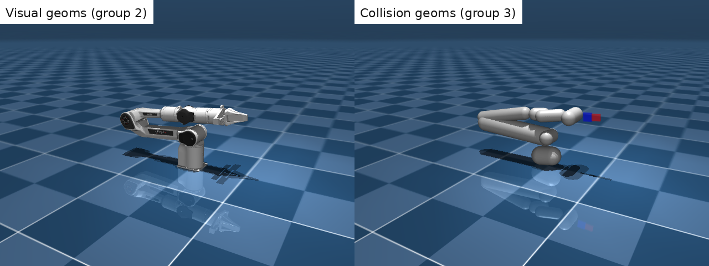
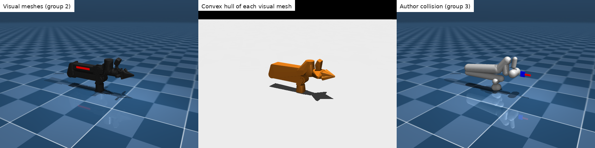

# Geometry and collision

The renderer shows art. The physics engine collides with a **different object** that
happens to occupy the same neighborhood. If you treat “the mesh I see” as “the shape
the simulator touches,” contact, grasping, and tipping will lie to you until you
validate.

This chapter is about **how simulators represent geometry**, what **meshes** mean in
that context, why **convex hulls** appear everywhere, and how to **inspect and test**
collision separately from visuals. File-format details (URDF tags, MJCF `<compiler>`,
mesh paths) were covered in [Asset files](asset-files.qmd#asset-files); here we focus on the
ideas that cross [MuJoCo](https://mujoco.readthedocs.io/en/stable/), Motrix, [URDF](http://wiki.ros.org/urdf), and most other engines. Format and vendor links: [References — Robotics assets](references.qmd#robotics-assets).

## Three geometries, three jobs

Every rigid link carries up to three unrelated shape descriptions:

| Layer | Purpose | Typical source | If you get it wrong |
|---|---|---|---|
| **Visual** | Rendering, human inspection | High-poly mesh, materials, textures | “It *looks* like it should collide” |
| **Collision** | Contact, constraints, grasp checks | Primitives, convex hull(s), compounds | Slipping, jitter, missed contacts |
| **Inertial** | Mass, COM, inertia tensor | CAD, explicit `<inertial>`, or `from_geom` | Tips over, wrong dynamics, “floaty” arm |

URDF makes the split explicit: `<visual>` and `<collision>` are sibling tags on each
`<link>`. MJCF uses one `<geom>` element type for everything; you distinguish roles
with **`group`**, **`contype` / `conaffinity`**, and sometimes duplicate geoms on the
same body (one pretty, one ugly). Motrix inherits the same MJCF/URDF semantics when
it loads a model.

None of the three has to match the others. That is normal and intentional.

```text
link / body
  ├── visual geoms     → pretty mesh (e.g. group 2 in Menagerie MJCF)
  ├── collision geoms  → capsules / hulls (e.g. group 3; contype set)
  └── inertial block   → mass, COM, inertia (may be from geoms or explicit)
```

Setting `pos` on a geom does **not** move the center of mass unless inertia is computed
`from_geom` or you edit `<inertial>` directly — see
[Link frame vs inertial frame](rotations-and-frames.qmd#link-frame-vs-inertial-frame).
A visual mesh whose artist origin is not the COM is a common source of “it tips over in
sim.”

**Team policy (recommended):**

> **Visual:** any mesh, any poly count.  
> **Collision:** primitives or reviewed convex pieces, authored separately.  
> **Never** ship “we used the visual mesh for collision because it was easier.”

## Primitives: what simulators prefer

Analytic shapes are cheap, stable, and easy to debug. Production robots are usually
**compounds** — several primitives (or several convex pieces) per link, not one mesh
per link.

| Primitive | MuJoCo `type` | URDF `<geometry>` | Notes |
|---|---|---|---|
| Sphere | `sphere` | `<sphere radius="…"/>` | Cheapest contact; good for knobs, simplified joints |
| Capsule | `capsule` | *(no native tag — use cylinder or mesh)* | Excellent for links and limbs; MuJoCo default for many pipelines |
| Box | `box` | `<box size="…"/>` | Tables, walls, rough link envelopes; `size` is half-extents in MuJoCo |
| Cylinder | `cylinder` | `<cylinder radius="…" length="…"/>` | Wheels, pegs; watch axis alignment (URDF Z vs your export) |
| Plane | `plane` | `<plane …/>` (limited) | Infinite ground; foot sliding and contact normals need care |
| Ellipsoid | `ellipsoid` | — | Less common; know it exists |

**Height fields** (`hfield` in MuJoCo) are terrain meshes sampled on a grid — useful
for uneven ground, rarely your first debugging problem.

Bullet, PhysX, and ODE use the same primitive vocabulary under different names. When
you export from CAD or Isaac, you are often **fitting** or **decomposing** into these
primitives whether you see them or not.

*(To fill: a 2-DoF arm with capsule link collision + mesh visuals only; MJCF snippet.)*

### Collision filtering (MuJoCo)

Geoms also carry **bitmasks** that decide *who collides with whom*:

| Attribute | Meaning |
|---|---|
| `contype` | “I am type …” (bit set) |
| `conaffinity` | “I collide with types …” (bit mask) |

Two geoms collide when `(contype_a & conaffinity_b) || (contype_b & conaffinity_a)`.
Accidentally zeroing these is a silent “ghost robot walks through the table” bug.
Visual-only geoms often use `contype="0" conaffinity="0"` so they never participate
in contact.

## Soft vs hard contact {#soft-vs-hard-contact}

When two collision geoms overlap, the engine must decide what **forces** (and
**impulses**) to apply. That choice — **soft (compliant)** vs **hard
(non-penetrating)** — is one of the biggest behavioral gaps between simulators.

### Soft contact (compliant)

Small **penetration is allowed**. Normal forces come from a spring–damper on
penetration depth (friction acts on the tangent). Contacts feel damped or
“squishy”; the solver stays stable at moderate timesteps. You tune stiffness and
dissipation rather than forbidding overlap outright.

**MuJoCo uses soft contact only.** Contacts are penalty constraints controlled by
[`solref` and `solimp`](https://mujoco.readthedocs.io/en/stable/modeling.html#csolver)
on geoms or contact pairs (plus [`margin`](https://mujoco.readthedocs.io/en/stable/XMLreference.html#body-geom-margin)).
You can make contacts very stiff, but the formulation still permits brief
interpenetration — that is why the validation step below speaks of “light
penetration” pushing out smoothly instead of snapping to zero gap.

### Hard contact (non-penetrating)

Bodies are driven toward **no interpenetration** each step. Contact is often
formulated as inequalities or impulses (LCP-style solvers): overlap generates a
**constraint impulse** that separates bodies, with **restitution** controlling
bounce. Stacks and impacts can look crisp; too large a timestep or wrong material
can produce jitter or explosive bounces.

**NVIDIA PhysX** (Isaac Sim / Isaac Lab) is in this camp by default. You tune
**physics materials** (static/dynamic friction, restitution), **contact offset**,
and solver iterations — not MuJoCo’s `solref`/`solimp`. See [Two simulators — Isaac Lab](two-simulators.qmd#isaac-lab).

### Motrix: both modes on MJCF

**Motrix** implements its **own constraint solver** (not MuJoCo’s), but loads the
same MJCF/URDF assets. For contact it supports **soft and hard**:

| Mode | MJCF | Behavior |
|---|---|---|
| **Soft** (default on standard geoms) | `solref`, `solimp` as in MuJoCo | Compliant contact, same *parameters* as Menagerie/MuJoCo tuning |
| **Hard** (Motrix extension) | `_hard="true"`, `_bounciness`, `_erp` on `<geom>` | Non-penetrating-style contact; restitution + error-reduction replace `solref`/`solimp` |

Example from [MotrixSim — Case comparison](https://motrixsim.readthedocs.io/en/latest/user_guide/overview/case_comparison.html) (Newton’s cradle — MuJoCo file is soft-only, Motrix file adds hard geoms):

```xml
<geom _hard="true" _bounciness="1" _erp="0" />
```

**This tutorial’s Piper demos** use **unmodified Menagerie MJCF** — no `_hard`
flags — so both MuJoCo and Motrix read the same **soft** `solref`/`solimp`
data. Dynamics can still **differ** between engines because the solvers are not
the same (`scripts/motrix_robot_demo.py` warns on unsupported `<option>` tags
and slight timestep behavior). When comparing Motrix to MuJoCo on Menagerie, treat
contact as **soft-parameterized in both**, not hard PhysX-style.

### Why this matters when switching engines

| Symptom when porting | Often means |
|---|---|
| MuJoCo grasp “mushy”, Isaac grasp brittle | Soft penetration vs hard zero-gap |
| Isaac stack jitter at your RL timestep | Hard contacts + large `dt` |
| Same `solref` copied into Isaac | Wrong knob — use PhysX materials instead |
| Motrix vs MuJoCo disagree on Menagerie | Same soft XML, different solvers — compare side by side |

More links: [References — Contact models](references.qmd#contact-models).

## Meshes: triangles, quads, watertight

### Triangles vs quads

| Context | What you usually have |
|---|---|
| **Rendering** (USD, glTF, Blender) | Quads and n-gons are fine |
| **Collision pipelines** | Almost always **triangles** internally |
| **URDF / OBJ / STL** | Typically triangles; STL is ubiquitous in robotics |

MuJoCo triangulates mesh geoms at load time. Do not assume the render mesh you export
from a DCC tool is sim-ready just because it looks correct in the viewport.

### Watertight, manifold, closed

Plain-language definitions:

- **Watertight (closed):** every edge is shared by exactly two faces; the mesh encloses
  a well-defined volume.
- **Manifold:** locally looks like a thin sheet of paper — no T-junctions, no random
  internal faces (stricter than watertight in practice; tools disagree on wording).

**Why simulators care:**

- **Volume → mass** when using inertia `from_geom` or density on geoms.
- **Convex hull algorithms** behave badly on open soup, duplicated vertices, or
  self-intersections.
- **Phantom contacts** appear when normals flip or faces intersect themselves.

### Basic mesh processing checklist

Before a mesh becomes a collision or inertial input:

1. **Units:** meters in sim. STL in millimeters → robot the size of a building.
2. **Axis:** Z-up vs Y-up at export; apply the transform in the file, not in your head.
3. **Triangulate** for collision; remove degenerate (zero-area) triangles.
4. **Merge vertices** / remove duplicates; fix inverted normals (consistent outward).
5. **Decimate visuals** if needed; **never** decimate collision without re-checking hull
   or contacts.
6. **Track large assets** with Git LFS — see
   [GitHub and version control](github-version-control.qmd#git-lfs).

Handy tools: Blender, MeshLab, and Python **[trimesh](https://trimesh.org/)** for quick inspection
(`is_watertight`, `volume`, convex hull preview). STL is common and often **broken**
(non-manifold, holes, wrong scale) — treat it as guilty until inspected.

*(To fill: `trimesh` one-liner on a tutorial mesh; link to repo path under `assets/`.)*

## Convex hulls: what they are and why we need them

The **convex hull** of a mesh is the smallest convex set that contains all its
vertices — imagine shrink-wrapping the shape with no dents allowed.

```text
        visual mesh (concave seat)
       /‾‾‾‾\___/‾‾‾‾\
      |  hole  |      |        convex hull fills the hole
       \_____/ \____/         → robot “sits” on invisible material
```

### Why engines convexify

| Concave mesh–mesh | Convex–convex |
|---|---|
| Expensive, fragile contact | Fast, continuous, well-studied |
| Needs decomposition or special cases | Default path in most engines |

So simulators **approximate** concave geometry by one or more of:

1. **Single convex hull** per mesh geom (conservative outer shell).
2. **Convex decomposition** — many hulls per link (VHACD, CoACD, manual compounds).
3. **Primitives** — capsules/boxes fitted by hand (often the most robust).
4. **SDFs / other fields** — newer options in some engines; check your version and docs.

**MuJoCo:** a `mesh` geom uses the **convex hull** of the referenced vertices at compile
time (unless you have moved to alternate representations in your toolchain). The hull
is often **larger** than the visible mesh: thin walls become thick, holes get plugged.
That applies to **collision** mesh geoms too — a misconfigured asset may convexify the
wrong mesh or use a hull where capsules were intended.

[If collision geoms are mesh-backed, the simulator contacts the hull, not the render
surface. A convexified collision mesh can look “correct” in a viewer and still grasp,
slide, or support weight incorrectly.]{.common-bug-warning}

**URDF / Isaac-style pipelines:** multiple `<collision>` entries per link are normal —
each piece is convex or primitive.

### When a hull lies

| Symptom | Likely cause |
|---|---|
| Floats above the table | Hull bottom is higher than visual sole |
| Jitter in narrow gaps | Hull filled a concavity; contacts fight |
| Misses thin features | Hull smoothed over fingers, pegs, edges |
| Stable but wrong grasp | Hull wider than fingers; contact early/late |

Fix: add **compound** geoms (several capsules/boxes), run **convex decomposition**, or
simplify the part that needs precision (gripper pads as boxes, not one mesh hull).

## Collision ≠ visuals: inspect and validate

This is the highest-leverage section. Build a habit **before** tuning controllers.

### Inspect in the viewer

- Toggle **collision geoms** on and **visuals** off (MuJoCo viewer flags; Motrix viewer
  layers when available).
- For each link: geom **count**, **type**, **pos/quat**, **scale** on meshes.
- Compare **link frame** (joint attachment) to where the collision volume sits — offset
  bugs dominate “everything is shifted by 5 cm.”
- Print or browse the model’s geom list at load time (`model.geom_type`, names, parent
  body).

#### Example: MuJoCo Menagerie arms (visual vs collision)

We pin two robots from [MuJoCo Menagerie](https://github.com/google-deepmind/mujoco_menagerie)
(**AgileX Piper** and **ARX L5**) as **third-party assets** — not copied into this repo.
Fetch them once with `bash scripts/fetch_menagerie_assets.sh` (sparse git checkout;
see [Asset files](asset-files.qmd#vendor-layout) and
[Large files](github-version-control.qmd#third-party-assets-sparse-checkout)).

Both models use the same MJCF pattern: **`class="visual"`** geoms on **group 2**
(`contype="0"`, mesh for rendering) and **`class="collision"`** geoms on **group 3**
(capsules, mesh convex hulls, or boxes for contact). The figures below render each
layer separately at the default pose (offscreen MuJoCo + `trimesh` convex hulls for
the middle column):





Read left → right:

1. **Visual meshes** — what you paint; high detail, not used for contact here.
2. **Convex hull of each visual mesh** — what MuJoCo (and most engines) would use if
   you dropped the raw render mesh into a `mesh` collision geom. Hulls **fill concavities**
   and add volume (orange “shrink-wrap”). Menagerie does **not** use this for contact,
   but third-party assets sometimes do by mistake.
3. **Author collision** — what the asset author actually configured (capsules, mesh
   hulls, boxes on group 3).

[Upstream assets are not guaranteed to be sim-ready. Even when collision geoms exist, they may be misaligned, too coarse, or themselves mesh convex hulls that behave badly (phantom contact, missed gaps, wrong grasp timing). The middle column is the shape you get if someone convexifies the **visual** mesh — often worse than hand-authored collision. Always run the validation workflow below; do not trust the Menagerie / URDF name alone.]{.common-bug-warning}

Piper’s author collision mixes **capsules** with **mesh convex hulls** on some links —
chunkier than the paint. L5 uses **box** finger collision while visuals stay detailed
meshes. Compare each column before tuning controllers on a new robot.

Regenerate figures after bumping `third_party/assets.lock.json`:

```bash
bash scripts/fetch_menagerie_assets.sh
uv sync --extra mujoco
MUJOCO_GL=osmesa PYOPENGL_PLATFORM=osmesa \
  uv run python scripts/render_menagerie_geometry_figures.py
```

On Linux CI, install `libosmesa6` first. GitHub Actions workflow
`.github/workflows/regenerate-menagerie-images.yml` runs the same steps and commits
updated PNGs when the lock file or render script changes. Background on `DISPLAY`,
`MUJOCO_GL`, and OSMesa vs EGL: [Common environment variables — headless rendering](environment-variables.qmd#displays-opengl-headless).

*(To fill: `scripts/collision_debug.py` — print geom summary per link from Menagerie XML.)*

### Validation workflow

Run these in order when importing a new asset:

1. **Drop test** — spawn slightly above ground; first contact should match where the
   collision sole is, not where the paint is.
2. **Light penetration** — start barely embedded; with **soft** contacts (MuJoCo,
   default Motrix on Menagerie) penetration should push out smoothly, not explode.
   Wrong hull scale or bad `solref`/`solimp` still breaks this — see
   [Soft vs hard contact](#soft-vs-hard-contact).
3. **Known configuration** — gripper closed on a box: how many contacts? stable or
   buzzing?
4. **FK cross-check** — site / EE frame vs bounding box of **collision** geoms, not
   the visual mesh ([Forward kinematics](forward-kinematics.qmd#forward-kinematics)).
5. **Inertia sanity** — is the COM inside the collision envelope? Does the link tip
   the way you expect when you push it?

### Common failure modes

Future chapters will mark these patterns in **red** with the `.common-bug-warning`
style; a few are called out here already.

| Bug | What you see |
|---|---|
| Visual mesh used for collision | Slow sim, jitter, “invisible” bumps |
| Trusting upstream collision without validation | Looks fine in viewer; wrong contact in sim |
| Mesh collision geom (convex hull) on concave link | Phantom volume, blocked gaps, bad grasps |
| STL in mm, sim in m | Giant or microscopic robot |
| Artist origin ≠ link frame | Whole robot shifted / rotated |
| Single concave mesh, one hull | Chair seats, bowls, grasps behave wrong |
| `from_geom` on visuals only | Mass and COM from render mesh |
| `contype` / `conaffinity` typo | Passes through floor or itself |
| Duplicated collision geoms | Double contact stiffness, mysterious forces |

**Dynamics** uses these shapes for contact; **kinematics** does not — but bad collision
geometry still breaks IK targets that assumed you could reach without hitting the table.
See [Kinematics vs dynamics](kinematics-vs-dynamics.qmd#kinematics-vs-dynamics).

At runtime, contact arrays (e.g. MuJoCo `data.contact`, `mj_contact`) tell you what
actually touched. Trust those over the viewport when debugging grasps.

## Where this goes in the pipeline

| Topic | Chapter |
|---|---|
| Names: body, joint, geom, site | [Scene vocabulary](scene-vocabulary.qmd#scene-vocabulary) |
| URDF/MJCF files, `<meshdir>`, compiler | [Asset files](asset-files.qmd#asset-files) (previous) |
| **Shapes, meshes, hulls, validation** | *this chapter* |
| Load model, step sim | [Two simulators](two-simulators.qmd#two-simulators) |

Author collision geometry in the asset file, validate it once in the viewer and with the
tests above, then leave it alone during control tuning. Mesh paths and “inertia from
geom” belong in [Asset files](asset-files.qmd#asset-files) — not in the control loop.
