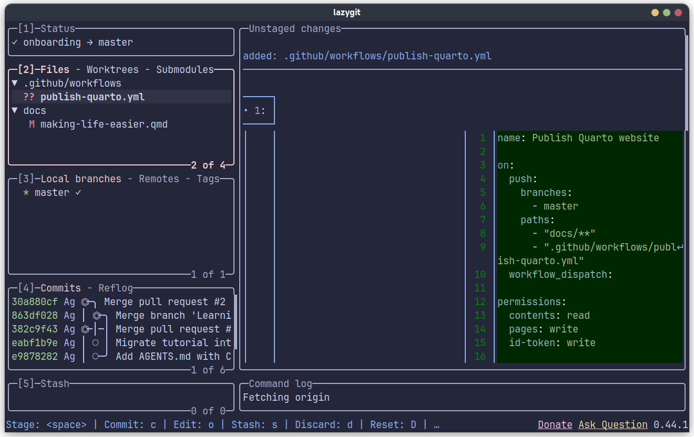
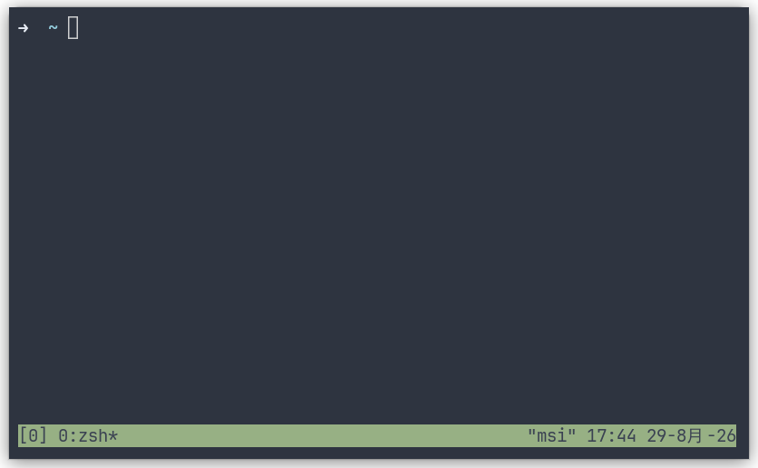
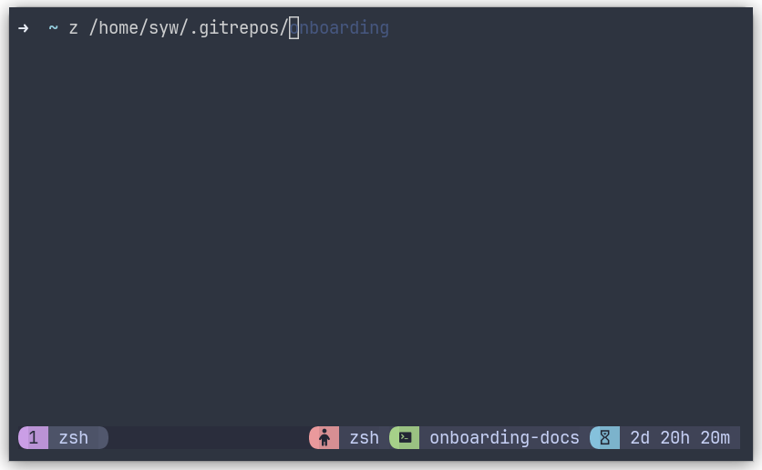

# Making Life Easier

The interpreter will run whatever you wrote. The editor can only help if it *understands* the code. Two things make that possible: **type hints** in our Python, and **stubs** for libraries that have no Python source.

## Type hints

A type hint is a note on a name that says what it is supposed to be. Python **does not enforce** this at runtime (passing a `str` where you annotated `float` still runs). The editor, and optional checkers like Pyright, read the notes.

```python
def damped_lstsq(J, dx, damping=1e-3):
    ...
```

becomes (see `src/robotics/ik/differential.py`):

```python
def damped_lstsq(J: np.ndarray, dx: np.ndarray, damping: float = 1e-3) -> np.ndarray:
```

What you get:

- Hover over `damped_lstsq` in `scripts/train.py` and the editor shows the signature.
- Pass `damping="lots"` and the editor underlines it *before* you run anything.
- Autocomplete on `data.` only works if the editor knows `data`'s type.

Annotate arguments and return types first. That is most of the value. Variable annotations (`qpos: np.ndarray = …`) are optional.

Hints are not conversions. This still runs, and is still wrong:

```python
def f(x: float) -> float:
    return x

f("hello")  # runtime: ok; editor: error
```

Keep hints honest and simple (`np.ndarray`, `float`, `str`, `list[int]`). Over-precise NumPy shapes are optional later; a wrong hint is worse than none.

## Editor and stubs

The language server (Pylance in VS Code, Cursor's Pyright) is a second program. It does **not** use your shell's [`PYTHONPATH`](environment-management.qmd#environment-variables). It uses:

1. The **selected interpreter** (status bar → `.venv/bin/python`). That is how it finds `numpy` and an editable `robotics`.
2. **`extraPaths`** — extra folders to search, the editor's analogue of [`PYTHONPATH`](environment-management.qmd#environment-variables).
3. **`stubPath`** — a folder of `.pyi` files that overlay types onto installed packages.

`.vscode/settings.json` in this folder sets both (Cursor reads `cursorpyright.analysis.*`; VS Code reads `python.analysis.*`). They apply when this folder is the workspace root; if you opened a parent folder, copy the same keys into that workspace's settings.

```json
{
    "python.analysis.extraPaths": [
        "${workspaceFolder}/src",
        "${workspaceFolder}/typings"
    ],
    "python.analysis.stubPath": "${workspaceFolder}/typings",
    "cursorpyright.analysis.extraPaths": [
        "${workspaceFolder}/src",
        "${workspaceFolder}/typings"
    ],
    "cursorpyright.analysis.stubPath": "${workspaceFolder}/typings"
}
```

`extraPaths` is why you add sibling source trees the editor should see (`src/` here; in a larger workspace, other packages that are not installed into this env). `stubPath` is for **types without source**.

The same keys can live in `pyproject.toml` under `[tool.pyright]`, so the checker is not editor-only.

### Why MuJoCo needs stubs

`import mujoco` works at runtime. The library is a **C++ extension** (pybind11). There is no `mujoco.py` full of Python for the editor to parse, so every name is `Unknown`: no hover, no completion, noisy red squiggles.

A **stub** is a `.pyi` file: types only, never executed. `typings/mujoco/__init__.pyi` might contain lines like:

```python
def mj_step(m: MjModel, d: MjData, nstep: int = 1) -> None: ...
```

The editor reads that; `python scripts/mujoco_hello.py` still runs the real C++ module.

### Generate them

```bash
uv sync --extra mujoco
bash scripts/generate_mujoco_stubs.sh
```

The script runs `pybind11-stubgen` against the *installed* `mujoco`, writing `typings/mujoco/*.pyi`. Then open `scripts/mujoco_hello.py`, hover `MjModel` / `mj_step`. If types do not appear, reload the window.

`pybind11-stubgen` **imports the package and inspects it**. Stubs must be regenerated when you bump the MuJoCo version. Generated files can include machine-specific OpenGL backends (`glfw` vs `egl`); that is fine for local editor use. Do not treat them as a hand-written API.

Select the `.venv` interpreter so `import mujoco` in the editor is the same copy the stub generator saw.


## Quality-of-life tools

These tools will make you happier. They are optional, but worth it.

### Zsh

[Zsh](https://www.zsh.org/) is a shell, like Bash, with stronger customization. It is already the default shell on recent macOS versions. On Ubuntu:

```bash
sudo apt install zsh  # install zsh through apt
chsh -s "$(command -v zsh)"  # change default shell to zsh
```

Log out and back in after `chsh`.

Your shell configuration lives in `~/.zshrc` (just like `~/.bashrc`).

[Oh My Zsh](https://ohmyz.sh/) provides a ready-to-use default configuration and a plugin system, which is highly recommended. Install it with:

```bash
sh -c "$(curl -fsSL https://raw.githubusercontent.com/ohmyzsh/ohmyzsh/master/tools/install.sh)"
```

Here are some **highly recommended** plugins to install:

```bash
git clone https://github.com/zsh-users/zsh-autosuggestions \
  "${ZSH_CUSTOM:-$HOME/.oh-my-zsh/custom}/plugins/zsh-autosuggestions"
git clone https://github.com/agkozak/zsh-z.git \
  "${ZSH_CUSTOM:-$HOME/.oh-my-zsh/custom}/plugins/zsh-z"
```

Enable them in `~/.zshrc`, then run `source ~/.zshrc`:

```zsh
plugins=(git zsh-autosuggestions zsh-z)
```

- `git`: provides aliases such as `gst` for `git status`.
- `zsh-autosuggestions`: suggests commands from your history as you type.
- `zsh-z`: jumps to frequently used directories, for example `z onboarding`.

### Lazygit

[Lazygit](https://github.com/jesseduffield/lazygit) is a TUI (terminal or text UI) for Git. It makes staging, reviewing diffs, committing, and switching branches faster. You should still understand the underlying Git operations, Lazygit is only a client UI. Follow its [installation instructions](https://github.com/jesseduffield/lazygit#installation).


Run `lazygit` inside a repository. Use the arrow keys or `h`/`j`/`k`/`l` to move, `Space` to stage a file, `c` to commit, and `p/P` to pull or push. Press `?` to see the keys available in the current panel.

[Delta](https://github.com/dandavison/delta) makes git diffs easier to read. Follow its [installation guide](https://dandavison.github.io/delta/installation.html), then refer these examples if needed:

- [Delta configuration with a Catppuccin theme](https://github.com/syw-robotics/dotfiles/blob/main/delta/.config/delta/catppuccin.gitconfig)
- [Lazygit configuration using Delta](https://github.com/syw-robotics/dotfiles/blob/main/lazygit/.config/lazygit/config.yml)

::: {.lazygit-figure}
{fig-alt="The Lazygit interface with repository status, changed files, branches, commits, and a file diff."}
:::


### tmux

[tmux](https://github.com/tmux/tmux) stills keeps terminal sessions alive after you disconnect it. It is useful for running training jobs on a remote server.

**Keep jobs running safely.** Closing your terminal or the SSH connection will stop the job, which is not happy; Please make sure to use tools like tmux when running training jobs. After training, you can still reconnect to the session later to check training results.

**Organize a workspace.** You may use tmux to organize your work. One session can contain:

- **Windows**, which behave like terminal tabs and can run separate tasks.
- **Panes**, which split a window so you can view multiple tasks together.

```bash
# Ubuntu
# The distribution version may be old, but is sufficient for basic use.
sudo apt install tmux
# macOS
brew install tmux
```

For daily use on Ubuntu, prefer a recent release. See the official [tmux installation guide](https://github.com/tmux/tmux/wiki/Installing) if the `apt` version is too old.

Start and reconnect to a named session:

```bash
tmux new -s work  # create a new session named "work"
tmux ls  # list sessions
tmux attach -t work  # reattach to the "work" session
```

Inside tmux, press the default **prefix** `Ctrl-b`, release it, then press one of these command keys. You can change the prefix in `~/.tmux.conf`.

| Key | Action |
|---|---|
| `c` | Create a window |
| `n` / `p` | Next / previous window |
| `%` / `"` | Split left-right / top-bottom |
| Arrow key | Move between panes |
| `d` | Detach; the session keeps running |


The default configuration is usable. For a theme and extra features, install [TPM: tmux plugin manager](https://github.com/tmux-plugins/tpm):

```bash
git clone https://github.com/tmux-plugins/tpm ~/.tmux/plugins/tpm
```

Add this minimal setup to `~/.tmux.conf`:

```tmux
set -g @plugin 'tmux-plugins/tpm'
set -g @plugin 'tmux-plugins/tmux-sensible'
set -g @plugin 'catppuccin/tmux'

run '~/.tmux/plugins/tpm/tpm'
```

Restart tmux, then press the **prefix** `Ctrl-b` followed by `I` to install the plugins.

::: {layout-ncol=2}
{fig-alt="A terminal running tmux with its default status bar."}

{fig-alt="A terminal running tmux with a Catppuccin status bar."}
:::

For a more complete setup, you may refer this [tmux configuration](https://github.com/syw-robotics/dotfiles/blob/main/tmux/.tmux.conf).
